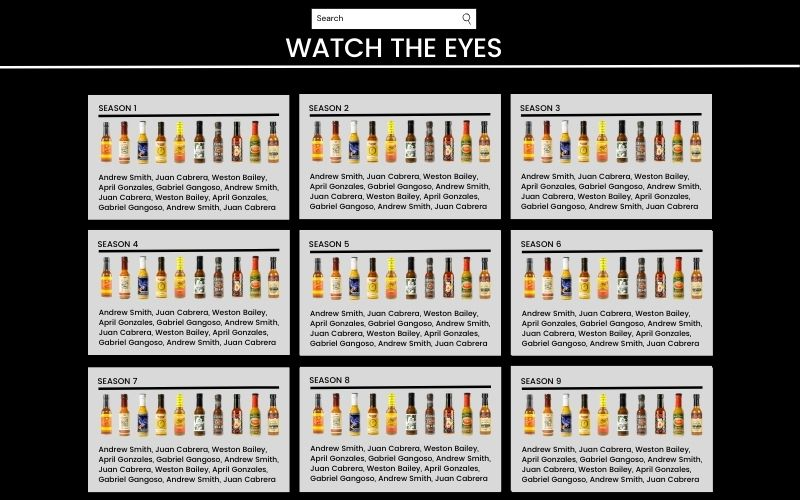
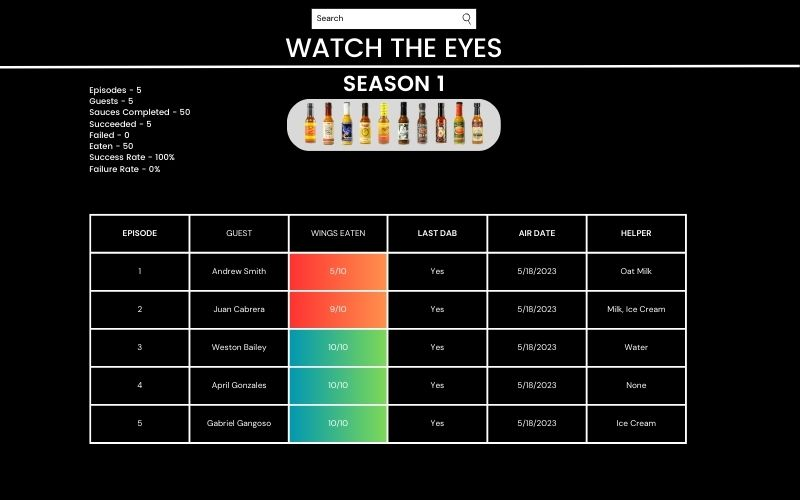
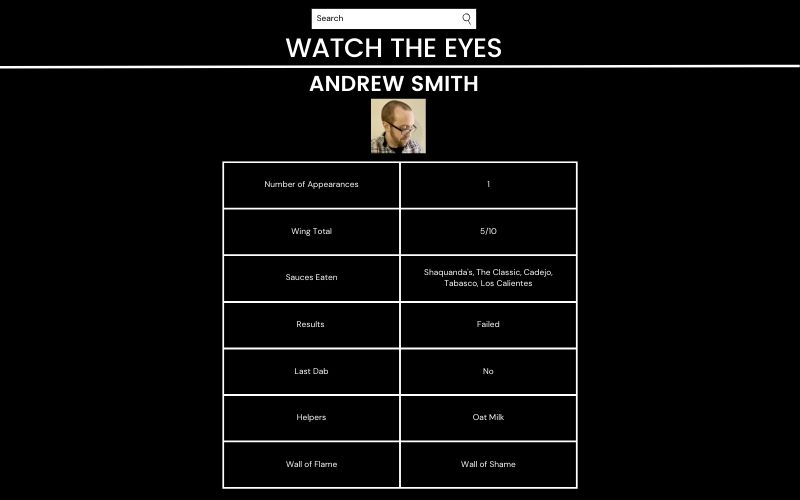
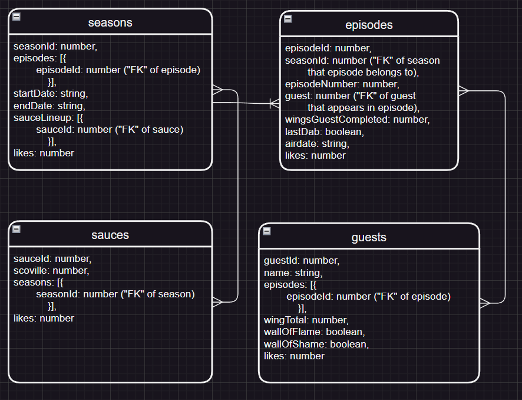

# Hot Ones Fan Site

Welcome to the Hot Ones Fan Site, the ultimate destination for fans of the popular YouTube show! Immerse yourself in the fiery world of Hot Ones as we bring you a comprehensive collection of episodes, guests, and mind-melting statistics.

Explore the Episodes section, where you'll find a catalog of each thrilling Hot Ones episode. From the scorching Season 1 to the latest release. Take a peek into the interesting facts of which guests conquer (or succumb to) the infamous hot wing challenge. Discover which ones made it to the Wall of Flame and which ones fizzled out to land in the notorious Wall of Shame.

Delve into the facinating profiles of each Guest, spanning a wide range of professions including actors, athletes, musicians, and more. Learn about their journey tackling on the sizzling hot wings as they take on the relentless spice of each sauce. With detailed information on each guests appearance, performance, wing count, and more.

Prepare your palette for the world of Hot Sauces. Discover the feverous lineup of sauces featured on the show, each with its own Scoville level, maker, and any helpers that were used to fight against the burning sensation in their mouths. 

But as always make sure to keep your hands away from your eyes as you feast on the Statistics provided by the site. We'll dive into the numbers while provided a sleek user-friendly interface to ensure all Hot Ones enthusiasts will have a stool to site on and a napkin in case. 

## Tech Stack

**Client:** 
Next.JS on top of React
Bootstrap for styling

**Server:** 
Javascript with Express
MongoDB as a database
Mongoose as our ODM

## User Stories

- As a user, I want to browse and explore episodes, so I can revisit my favorite standout episodes from across the years. 

- As a user, I want to search for specific guests, episodes, and seasons to learn about the interactions.

- As a user, I want to have a quick snapshot of who was able to go toe-to-toe with the wings and do something special, as well as who couldn't handle the heat and had to get out of the kitchen.

- As a user, I want to be able to see the hot sauce competition as it sizzles in every season. Not only their maker and Scoville level but also the helpers the guests had to use to take on that battle.

- As a user, I want to be able to follow the data through the storyline of the show. Every sauce, every season, every guest has a story.

- As a user, I want something that is visually appealing and can make me want to keep on digesting the site.

- As a user, I want a mobile-friendly design so I can enjoy the eye-catching site wherever I am and get lost in the sauce.

## Wireframes

## ERD

## MVP

- Landing page that details what the website offers and gives a call to action

- Clickable links that take you to relevant pages filled with detailed information

- The website will need to be accurate with the information it provides

- The front-end will need to be able to ping the API to grab the accurate information

- We'll need to display a list of Hot Ones episodes, including release dates and guest names.

- Provide detailed information on each episode that includes guest names, hot sauces, and more.

- Showcase profiles of each guests highlighting their professions, appearances, and how many wings they ate.

## Stretch Goals or MMP (Minimum Marketable Product)

- Heart counter tracked by cookie

- Implement cool charts/data visualizations through Javascript/HTML/CSS

- Make a open source API that other websites could ping for information

- Integrate a social media share button so people could share the pages with their friends

- Include other Hot Ones content links that include behind-the-scenes and promotional videos

- Make an admin page for easy maintenance of the site from the back-end

- Infographics with cool information that could be shared

## Sprint Days

Day 1:
- Define workload and who will take what
- Set up the dev environment, including server and database config

Day 2:
- Create the necessary database schema for the Hot Ones data.
- Load data into the database
- Implement and test each API route to ensure data retrieval and manipulation.

Day 3: 
- Develop the basic structure of the front-end website with limited design features.
- Create the essential pages, such as seasons, hot sauces, guests, and other relevant sections.

Day 4: 
- Design and style the website using CSS to improve its visual appeal.
- Create and integrate assets, including guest headshots, hot sauce images, and icons.

Day 5: 
- Integrate and showcase the statistical data obtained from the API.
- Develop visualizations, such as charts or graphs, to enhance the presentation of statistics.

Day 6:
- Conduct thorough testing of the website's functionality and responsiveness across different devices.
- Identify and address any bugs or issues encountered during testing.
- Optimize the website's performance and remove unnecessary code, including console.logs.

Day 7:
- Perform a final round of testing to ensure all features work as intended.
- Address any remaining issues or bugs identified during the testing phase.
- Prepare the website for deployment to a production environment.
- Document the setup instructions, APIs, and any additional information for future reference.

## Authors

- [Andrew Smith](https://www.github.com/continentaldivide)

- [Juan Cabrera](https://www.github.com/juanedcabrera)